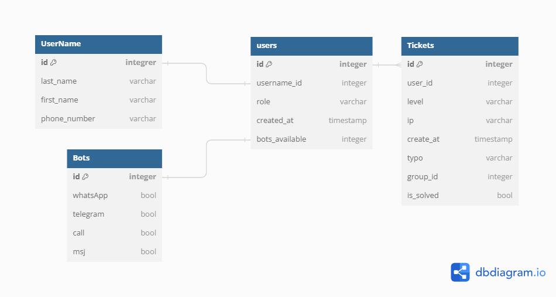

# Database

La base de datos es una de las partes fundamentales de este proyecto por dos razones: la primera es que nos permite construir 

dddlas relaciones entre las generadas por PingPlotter y el trabajo de los ingenieros que atienden la alarma. De forma general la base de datos registra a los ingenieros, que desde este momento llamaremos *usuarios,* y les asocia con un conjunto básico de datos de identificación que nos permite conocer el nombre del usuario, su número telefónico y el nivel de expertis. Por otro lado también almacena los tickets que son generados cuando se dispara una alarma de PingPlotter, estos registros contienen la información que permite identificar el origen y la urgencia por resolver. Estas dos tablas de datos son unidas según a un usuario se le asigne el ticket.

## Descripción

La tabla **users** almacena a los usuarios que han interactuado con el bot y se les relaciona con un registro único que permite conocer sus datos personales (**UserName**) y los bots que tiene activado (**Bots**). Por otro lado la tabla **tickets** almacena la información necesaria para dar un seguimiento a las alarmas que pingplotter genera.
