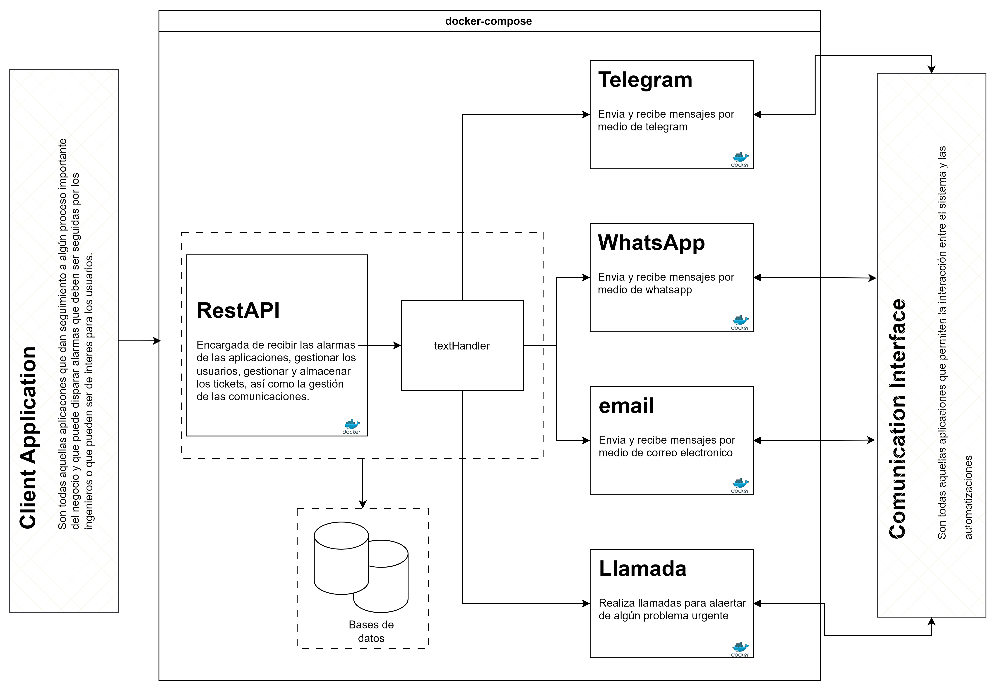

# Documentación

RT4Sentinel es un proyecto generado para informar sobre problemas detectados en aplicaciones externas, como [PingPlotter](./pingplotter.md), generando tickets y enviando mensajes por plataformas como WhatsApp o Telegram.

Para el desarrollo se trabaja con una arquitectura tipo monolíto, sin embargo incluye un middware que conecta a los [bots](./bots.md) de comunicación, la [base de datos](./database.md) y los [webhooks](./webhooks), que pueden ser ejecutados de forma idividual, como en los microservicios. La arquitectura base se muestra en la siguient figura:

La primera parte, de izquierda a derecha, se relaciona con las aplicaciones a terceros, que deberán interactuar con la aplicación por medio de un enpoint particular. Actualmente solo se cuenta con el endpoint para PingPlotter y deberá consultarse en los recursos recomendados que se encuentra al final del documento. La siguiente parte, el restAPI es el middware que contiene todas las rutas (endpoint) y la lógica de negocios.

En el intermedio existen funciones que construyen diferentes mensajes que después son enviados por los diferentes medios como: telegram, whataspp, email, etc. Por último, el resapi cuenta con webhooks que reciben los mensjaes de respuesta de los usuarios y que puede ser contestados por el bot (en desarrollo).

## Funcionalidades

Como se describe anteriormente, la aplicación tiene como funcionamiento base el dar alerta sobre algún problema que se presente en aplicaciones de terceros, como pingplotter, para ello es necesario contar con usuarios, que son aquellos a los que se les dará el aviso sobre algún problema. Para dar aviso es necesario contar con alguna forma de comunicación y cumpir los requisitos necesarios para enviar de forma segura. Por último es necesario contar con alguna forma de recibir respuesta sobre el estatus del evento.

1. Registro de usuarios.
2. Levantamiento de eventos.
3. Recepción de mensajes.

### Registro de usuarios

Los usuarios son una parte fundamental del proyecto y este no puede ser ejecutado sino existe al menos el registro de un usuario (para mayor conocimiento consulte: [usuarios](./routes/users.md)). Los usuarios son necesarios para asignarle un ticket y a partir de ello poder llevar un seguimiento de los tickets.

Cuando se recibe una alerta, se hace un llamado a la base de datos para obtener el registro de un usuario aleatorio (por desarrolloar una mejor lógica de asignación), para consumir su información y enviarle la alarma a sus contactos registrados. 

### Levantamiento de eventos

Los eventos pueden tener muchos origenes (consultar: [alarmas](./routes/alarmas.md)) una vez que se recibe un evento, se extraer la información necesaria para construir los mensajes de alerta que serán enviados por diferentes medios de comunicación, como correo electrónico, telegram y whatsapp.

### Recepción de mensajes 

La última parte de la aplicación se enfoca por medio de [webhooks](./routes/webhooks.md) de recibir mensajes de texto, los cuales son tratados y respondidos de forma semi-automática, para dar seguimiento personalizado  y ejecutar otras tareas como el cierre de tickets.
